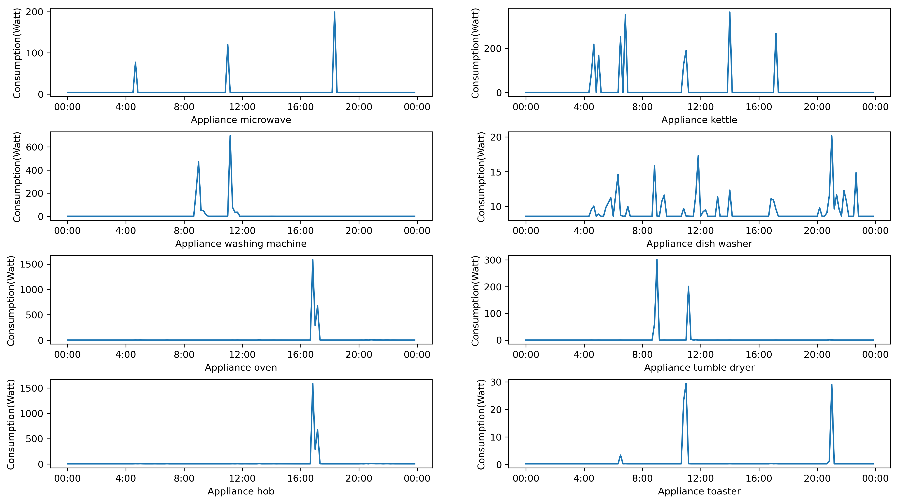
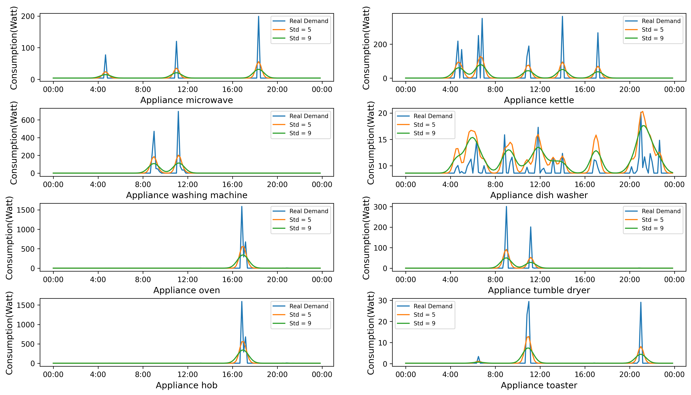
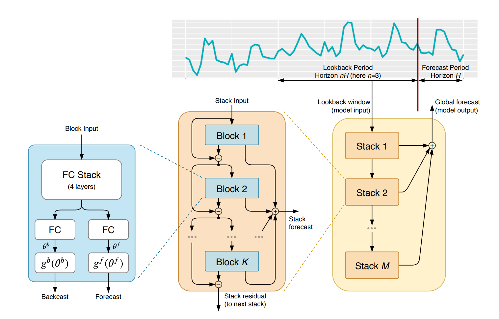
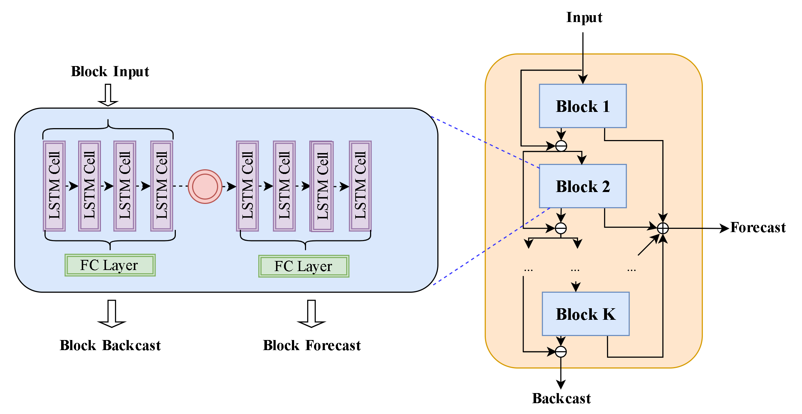
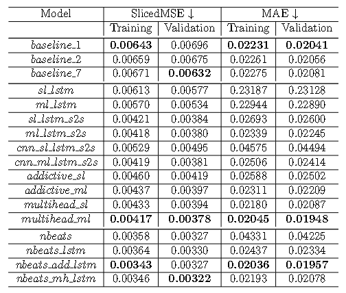
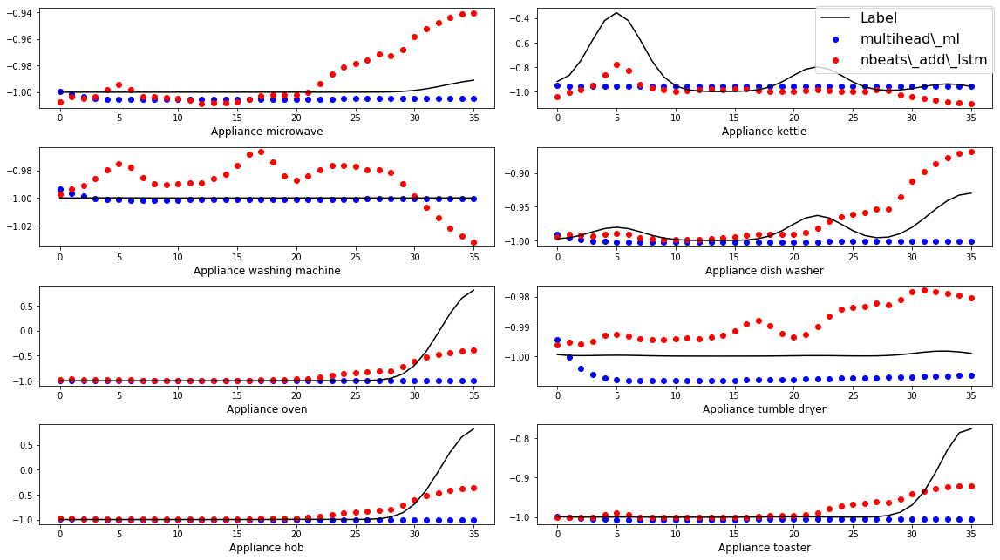

# N-BEATS-LSTM

Master Project with Informetis Ltd. The data belongs to the company, so it is not publicly available. 

* [Thesis Here](paper/Appliance%20Usage%20forecast%20using%20Electricity%20data.pdf)

## Introduction

Our project collects the electricity consumption of each of the eight appliances commonly used in households over a two-year period. Based on the data collected, we build a deep learning model for multi-step forecasting. This model is based on the N-BEATS model, an ensemble model based on the calculation of residuals. And our model change the base weak learner as LSTM-based model, which we name it as N-BEATS-LSTM. Compared to our proposed benchmark, our model has a 33\% performance improvement, ranging from 3\% to 30\% improvement compared to other deep learning models. In our experiments, we compared the contribution of various base model components to the overall performance of the model.

## Intermittent Data

For the data we have collected, we find that the problem we are dealing with belongs to a particular type of data in the time series, the intermittent demand problem. This type of data contains a large amount of inactive data, such as zero demand in the demand calculation. This type of data is discrete and there are long time intervals between active states. Correspondingly, most of the appliances in our data are in standby mode, while the electricity consumption we really want to estimate is spread over a very small number of time stamps. We therefore also need more specific models to solve this problem.

After analysed the data, we can see that almost every appliance has one or more peaks of use, and that the use of appliances is almost always distributed around the peaks. So we then thought that by distributing the demand for one demand over multiple time stamps in close proximity, we would be able to reduce the interval and increase the active time. We have used a normal distribution to normalise the demand. Using the timestamp *t* at which the demand occurs as the mean point, a normal distribution is created between *t-std* and *t+std* such that the values in this region are summed and equal to the actual demand at timestamp *t*.

## N-BEATS-LSTM Model

N-BEATS and its various transformations are able to achieve good results, and the N-BEATS transformations we found usually change the base blocks to adapt different tasks. In an N-BEATS network, the smallest unit of computation is a block, and a single block can be treated as a regression model. A block has two outputs, one for the prediction and one for the calculation of the residuals. In the original paper, the authors used 30 stacks, each containing one block, so that 180 layers of fully connected networks were used in the original network.

As shown in the above figure, we still kept the structure of the N-BEATS network, but used only one stack as the model. In the block we use the LSTM network with Seq2Seq structure as the base network. In the original NBEATS, a block has two different predictors outputting forecast and backcast, which correspond to the outputs of encoder and decoder in the Seq2Seq model. Each cell of the encoder corresponds to a timestamp, so it is straightforward to consider the output of the encoder as a backcast of the input sequence.

## Results

We designed various different LSTM-Based models and N-BEATS models to investigate the performance of different combinations through a series of experiments.

| Model Name | Details |
| --- | --- |
| *sl\_lstm* | Single Layer LSTM |
| *ml\_lstm* | Multiple Layers LSTM |
| *sl\_lstm\_s2s* | Single Layer LSTM with Seq2Seq Structure |
| *ml\_lstm\_s2s* | Multiple Layers LSTM with Seq2Seq Structure |
| *cnn\_sl\_lstm\_s2s* | CNN filter + Single Layer LSTM with Seq2Seq Structure |
| *cnn\_ml\_lstm\_s2s* | CNN filter + Multiple Layers LSTM with Seq2Seq Structure |
| *additive\_sl* | *cnn\_sl\_lstm\_s2s* + Additive Attention |
| *additive\_ml* | *cnn\_ml\_lstm\_s2s* + Additive Attention|
| *multihead\_sl* | *cnn\_sl\_lstm\_s2s* + Multi-head Attention|
| *multihead\_ml* | *cnn\_ml\_lstm\_s2s* + Multi-head Attention|
| *nbeats* |  General N-BEATS Model |
| *nbeats\_lstm* | N-BEATS Structure using *cnn\_sl\_lstm\_s2s* as blcok |
| *nbeats\_add\_lstm* | N-BEATS Structure using *additive\_sl* as blcok|
| *nbeats\_mh\_lstm* | N-BEATS Structure using *multihead\_sl* as blcok |

As the Table below shows, most of our models were able to do better relative to the benchmark. One of the *multihead\_ml* almost dominates the *LSTM-based* models. Compared to the benchmark, the loss value of *multihead\_ml* dropped by about 32\% and the MAE dropped by about 6\%. In contrast, the best performer in the *N-BEATS-based* model is *nbeats\_add\_lstm*, with a drop of about 45\% in loss value and 6\% in MAE compared to the benchmark. So in terms of MAE, the difference between *multihead\_ml* and *nbeats\_add\_lstm* is not that great.

It can be seen from the prediction results(figure below) that *multihead\_ml* tends to fit the data in the inactive state more. Even though he carries a lot of information in the first few timestamps, the model gradually weakens it and fits the predicted values to the undemanding state, which is nearly a straight line. The prediction of *nbeats\_add\_lstm*, on the other hand, will be more volatile than *multihead\_ml*, and will fluctuate with the true value.

